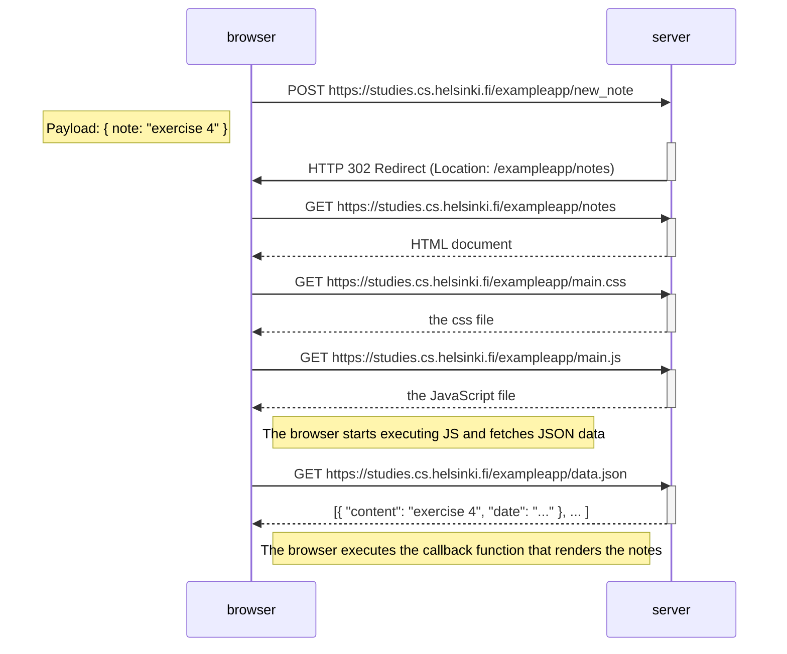

# Exercise 4: Adding new note on traditional notes web app

```mermaid
  sequenceDiagram
    participant browser
    participant server
  
    browser->>server: POST https://studies.cs.helsinki.fi/exampleapp/new_note
    Note left of browser: Payload: { note: "exercise 4" }
    activate server
    server->>browser: HTTP 302 Redirect (Location: /exampleapp/notes)
    deactivate server
  
    browser->>server: GET https://studies.cs.helsinki.fi/exampleapp/notes
    activate server
    server-->>browser: HTML document
    deactivate server
  
    browser->>server: GET https://studies.cs.helsinki.fi/exampleapp/main.css
    activate server
    server-->>browser: the css file
    deactivate server
  
    browser->>server: GET https://studies.cs.helsinki.fi/exampleapp/main.js
    activate server
    server-->>browser: the JavaScript file
    deactivate server
  
    Note right of browser: The browser starts executing JS and fetches JSON data
  
    browser->>server: GET https://studies.cs.helsinki.fi/exampleapp/data.json
    activate server
    server-->>browser: [{ "content": "exercise 4", "date": "..." }, ... ]
    deactivate server
  
    Note right of browser: The browser executes the callback function that renders the notes
```
