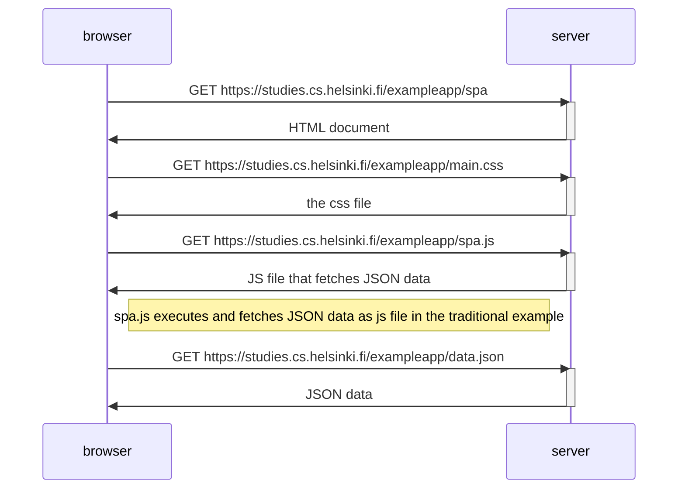

# Exercise 5: Opening Single Page Application version of Notes

```mermaid
  sequenceDiagram
    participant browser
    participant server
  
    browser->>server: GET https://studies.cs.helsinki.fi/exampleapp/spa
    activate server
    server->>browser: HTML document
    deactivate server
  
    browser->>server: GET https://studies.cs.helsinki.fi/exampleapp/main.css
    activate server
    server->>browser: the css file
    deactivate server
  
    browser->>server: GET https://studies.cs.helsinki.fi/exampleapp/spa.js
    activate server
    server->>browser: JS file that fetches JSON data
    deactivate server
  
    Note right of browser: spa.js executes and fetches JSON data as js file in the traditional example
  
    browser->>server: GET https://studies.cs.helsinki.fi/exampleapp/data.json
    activate server
    server->>browser: JSON data
    deactivate server
```
