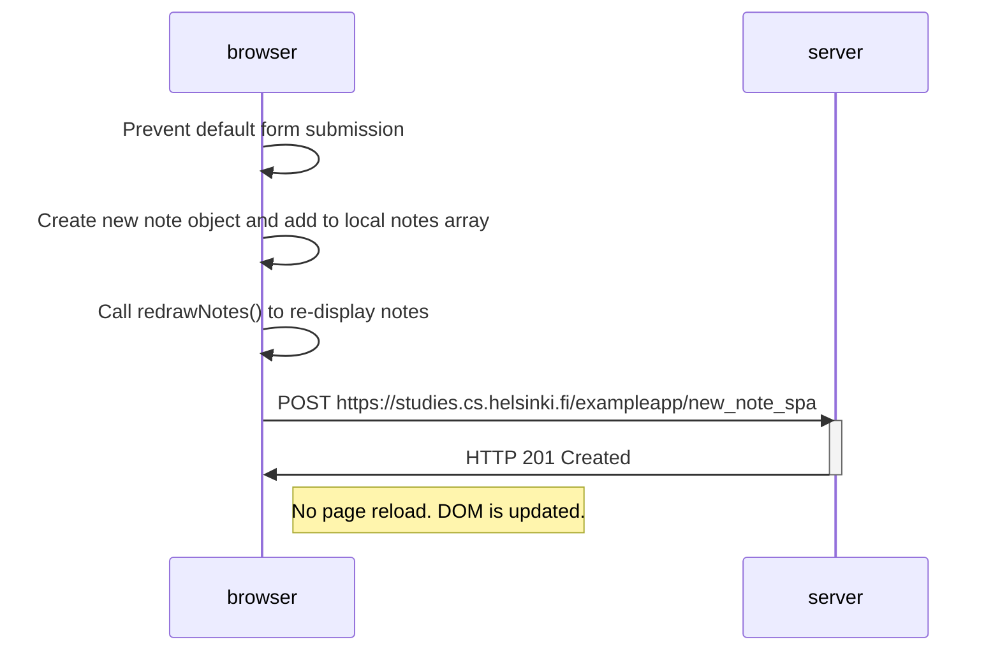

# Exercise 6: Adding note to single page app

```mermaid
  sequenceDiagram
    participant browser
    participant server
  
    browser->>browser: Prevent default form submission
    browser->>browser: Create new note object and add to local notes array
    browser->>browser: Call redrawNotes() to re-display notes
  
    browser->>server: POST https://studies.cs.helsinki.fi/exampleapp/new_note_spa
    activate server
    server->>browser: HTTP 201 Created
    deactivate server
  
    Note right of browser: No page reload. DOM is updated.
```
